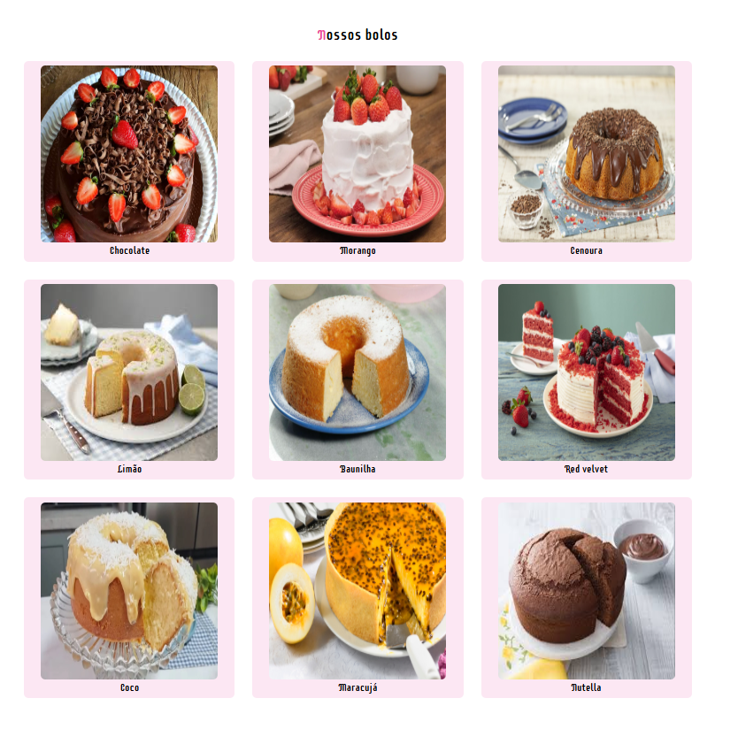

# 🍰 Loja de Bolos

Um projeto front-end de uma loja de bolos, desenvolvido com HTML e CSS.  
O objetivo é apresentar diferentes sabores de bolos em um layout simples.

---

## 📸 Preview

---

## 🚀 Funcionalidades

- Exibição de bolos com imagens
- Layout organizado em grade
- Design moderno com CSS
- Página leve e rápida

### Sabores disponíveis:
- 🍫 Chocolate  
- 🍓 Morango  
- 🥕 Cenoura  
- 🍋 Limão  
- 🍦 Baunilha  
- ❤️ Red Velvet
- 🍊 maracuja
- 🖤 nutella
- 🥥 coco

---

## 🛠️ Tecnologias Utilizadas

- HTML5  
- CSS3  

---

## 📂 Estrutura do Projeto

CP2-Front-end/
│
├── css/
│ ├── reset.css
│ └── style.css
│
├── imagens/
│
├── index.html
├── integrantes.txt
└── readme.md

---

## ▶️ Como Executar

1. Abra o link no Github Pages
---

## 👨‍💻 Integrantes

- Isaac     RM:569166
- Thalles   RM:569925
- João      RM:569562
- Murillo   rm:569045

---

## 📄 Licença

Este projeto foi desenvolvido para a faculdade da FIAP.

---

## ✨ Considerações

Projeto simples, focado em prática de HTML e CSS.

---

🍰 Feito com Sabor!

